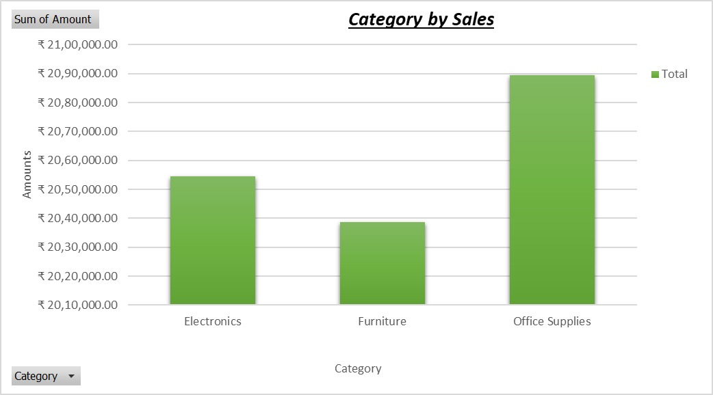
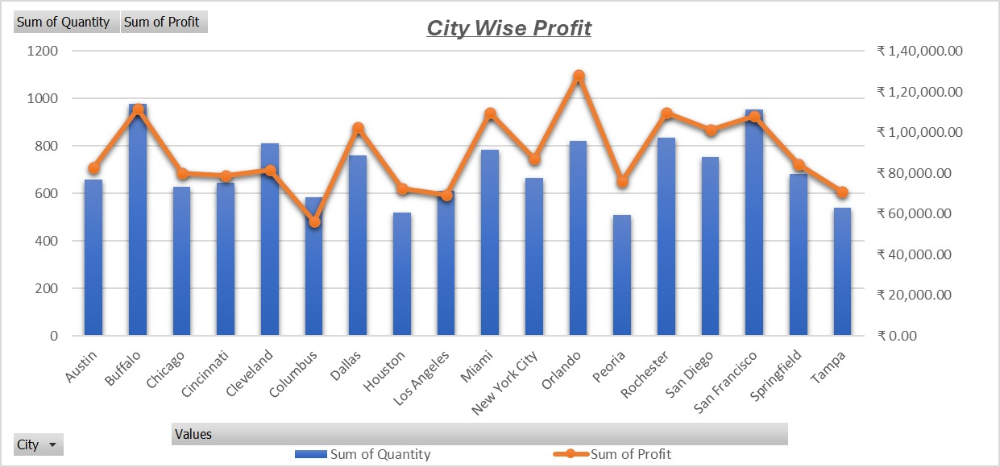

# Sales Data Analysis using Excel

## 📊 Project Overview

This project demonstrates basic data analysis and visualization using Microsoft Excel.

## 🛠 Tools Used

* Microsoft Excel

## 📌 Tasks Performed

* Data entry and formatting
* Applied basic functions (SUM, AVERAGE, COUNT)
* Created visualizations:

  * Bar Chart (Sales by Category)
  * Pie Chart (Payment Mode Distribution)
  * Line Chart (Sales Trend over Time)

## 📈 Key Insights

* Identified top-performing categories
* Analyzed customer payment preferences
* Observed sales trends over time

## 📷 Screenshots

### 📊 Sales by Category

### 🏙️ Profit by City

### 📈 Profit vs Amount

### 💳 Payment Distribution

### 📅 Sales Trend

## 🚀 Conclusion

This project helped in understanding how Excel can be used for basic data analysis and visualization.
